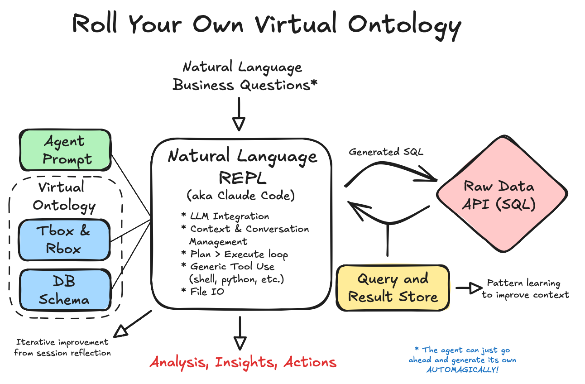

# Virtual Ontology: Direct SQL Generation from Business Language

## Overview

This project demonstrates an approach to semantic data access: using a "virtual ontology" layer that enables natural language REPLs (like Claude Code) to directly translate business questions into SQL. By combining traditional ontology concepts with modern LLM capabilities, we can query existing databases without the overhead of formal semantic systems.

## Conceptual Approach

An alternative data access pattern:

**Traditional**: Raw Data → ETL → Reports → Insights

**Virtual Ontology**: Raw Data → Semantic Layer → Natural Language Querying → Actionable Insights

## The Virtual Ontology Architecture



## Quickstart

Clone the repo, open a Claude Code session, load @sys_prompt.md in chat.

## Demo Video

🎬 [Roll your own virtual ontology!](https://www.youtube.com/watch?v=xEEZS0_Sbj0)

## How It Works

The virtual ontology approach:

1. **Keep data in place** - Query existing SQL databases directly
2. **Define business concepts** - Lightweight ontology (TBox/RBox) maps concepts to schema
3. **Leverage agent capabilities** - Natural language REPLs handle the translation
4. **Learn from usage** - Capture successful patterns for reuse


## What We've Learned

Through testing with real manufacturing data:

### Complex Business Analysis
- Identified significant improvement opportunities through systematic analysis
- 86% query success rate on first attempt, 98% with single refinement
- Handles temporal patterns, cascading failures, financial calculations

### Natural Language Translation
Questions like these translate effectively to SQL:
- "Which equipment is the bottleneck on each line?"
- "What's the financial impact of material jams?"
- "Show cascade failures from upstream equipment"
- "Find quality issues specific to morning shifts"

### Pattern Learning
- Intent capture with every query
- Successful pattern extraction and reuse
- Gradual improvement through usage

### Practical Performance
- Handles 36,000+ record datasets efficiently
- Supports complex aggregations and window functions
- Integrates well with python (visualization + advanced analysis)

## Example Implementation: Manufacturing Analytics

This repository includes a working implementation using Manufacturing Execution System (MES) data that demonstrates the approach:

### Types of Analysis Possible
1. **Capacity Analysis**: Compare best vs current performance
2. **Bottleneck Detection**: Identify constraining equipment
3. **Quality Investigation**: Find patterns in defect rates
4. **Downtime Impact**: Calculate financial cost of stoppages
5. **Cascade Analysis**: Trace upstream/downstream effects

## System Components

### 1. Ontology Layer (`ontology/ontology_spec.yaml`)
Defines business concepts, relationships, and rules:
- **Classes**: Equipment, Products, Events, Downtime Reasons
- **Relationships**: upstream/downstream, belongs-to, produces
- **Business Rules**: OEE calculation, cascade patterns, quality impact

### 2. Schema Mapping (`ontology/database_schema.yaml`)
Maps ontological concepts to database structure:
- Column mappings with business names
- Data types and constraints
- Indexed fields for performance

### 3. Query Interface (`query-log.sh`)
Intent-aware query execution with pattern learning:
- Captures business intent (≤140 chars)
- Logs successful patterns
- Builds reusable query library

## Comparison with Traditional Approaches

| Traditional Semantic Systems | Virtual Ontology Approach |
|------------------------------|---------------------------|
| Requires ETL to RDF/OWL | Works with existing SQL databases |
| SPARQL expertise needed | Natural language queries |
| Complex triple stores | Simple SQL execution |
| Static ontology definitions | Evolving pattern library |
| Slow iteration cycles | Rapid exploration |
| High implementation cost | Low barrier to entry |


## Contributing

This project explores the intersection of semantic technologies and modern LLM capabilities. We welcome:
- Use case implementations in new domains
- Ontology improvements and extensions
- Pattern learning enhancements
- Performance optimizations
- Documentation and tutorials

## Citation

If you use this virtual ontology approach in your work:
```
Virtual Ontology: Direct SQL Generation from Business Language
[Repository URL]
2025
```

## License

[To be determined]

---

*This project demonstrates that combining traditional ontology concepts with modern agent-based tools can create practical solutions for semantic data access.*