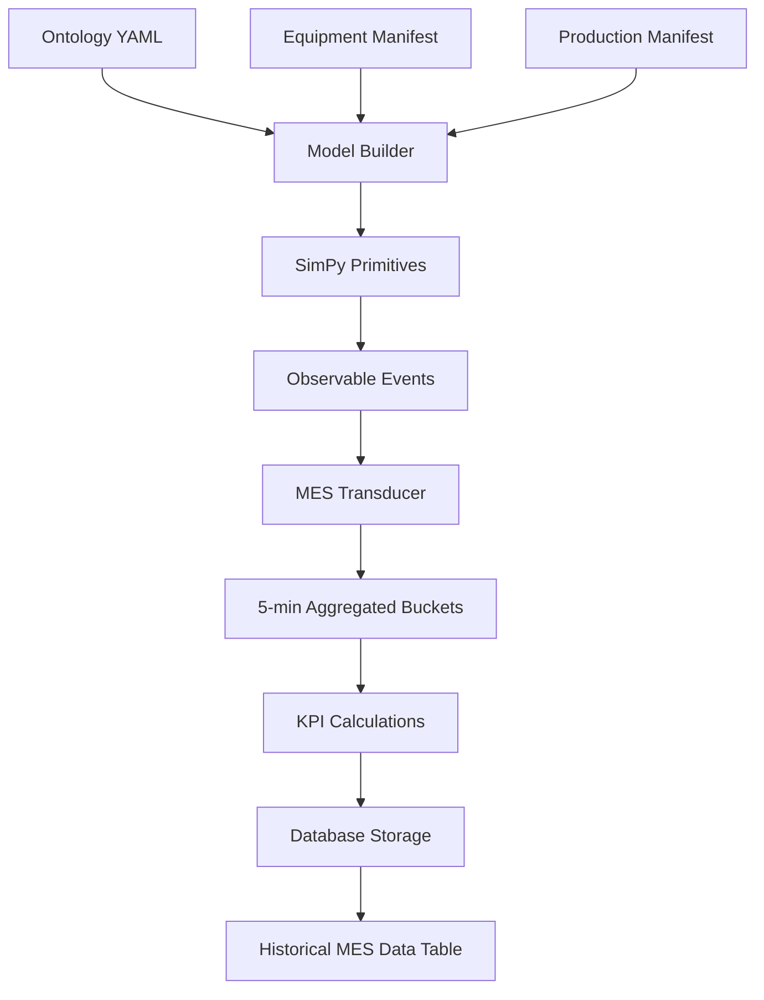

# Synthetic Data Generation Tuning Plan

## Executive Summary

This plan addresses the current mismatch between generated synthetic data and target historical KPIs. The virtual twin system is producing data with OEE of 72.2% when the target is 47.0%. This document provides a systematic approach to tune the manifests to achieve the target profile while maintaining realistic manufacturing patterns.

## Current State Analysis

### Generated vs Target KPIs

| Metric | Current Output | Target | Gap |
|--------|---------------|--------|-----|
| **OEE** | 72.2% | 47.0% | +25.2% |
| **Availability** | 97.4% | 69.0% | +28.4% |
| **Performance** | 75.9% | 52.0% | +23.9% |
| **Quality** | 98.4% | 63.0% | +35.4% |
| **Downtime** | 1.7% | ~30% | -28.3% |
| **Scrap Rate** | 1.7% | 8-9% | -6.8% |

### Root Cause Analysis

1. **Availability Too High (97.4% vs 69%)**
   - Equipment MTBF values too high (150-250 minutes)
   - Failure pattern probabilities too low (0.002-0.005 per 5min)
   - MTTR values too short (20-60 minutes)

2. **Performance Too High (75.9% vs 52%)**
   - Performance_by_product factors too high (0.70-0.88)
   - No significant bottlenecks or starving/blocking
   - Source arrival rates now adequate (fixed to 100 units/min)

3. **Quality Too High (98.4% vs 63%)**
   - Base_scrap_rate too low (0.005-0.03)
   - Product-specific scrap rates not being used effectively
   - Quality degradation over time not significant enough

## System Architecture Overview

### Data Flow Pipeline



### Key Components

1. **Ontology** (`ontology/twin_ontology.yaml`)
   - Defines system structure and relationships
   - Specifies controllable parameters and their ranges
   - Maps primitive types to implementation classes

2. **Manifests** (`manifests/*.yaml`)
   - Equipment configurations (rates, failures, performance)
   - Product definitions (targets, costs, quality)
   - Production schedules and changeover matrices

3. **Synthetic Data Generator** (`generate_synthetic_historical.py`)
   - Runs multiple simulation variants with parameter variations
   - Combines results with temporal patterns (shifts, weekends)
   - Stores in database with source='synthetic'

4. **MES Transducer** (`twin_model/transduction/mes_transducer.py`)
   - Aggregates observables into 5-minute buckets
   - Calculates KPIs using standard formulas
   - Maps SimPy states to MES status codes

## Tuning Strategy

### Phase 1: Availability Tuning (Target: 69%)

#### Equipment Manifest Changes

```yaml
# Reduce MTBF values significantly (current: 150-250 min)
equipment:
  LINE1-FIL:
    mtbf: 90   # Was 180, reduce by 50%
    mttr: 40   # Was 45, slight decrease is OK
    
  LINE1-PCK:
    mtbf: 100  # Was 200
    mttr: 45   # Was 35
    
  LINE1-PAL:
    mtbf: 125  # Was 250
    mttr: 35   # Was 30

  # Similar reductions for LINE2 and LINE3
```

#### Failure Pattern Probability Increases

```yaml
failure_patterns:
  Filler:
    micro_stops:
      probability_per_5min: 0.05  # Was 0.005 (10x increase)
    quality_deviation:
      probability_per_5min: 0.03  # Was 0.003 (10x increase)
    valve_failure:
      probability_per_5min: 0.02  # Was 0.002 (10x increase)
      
  # Similar increases for Packer and Palletizer patterns
```

**Expected Impact**: 
- More frequent failures will reduce availability from 97.4% to ~70%
- Downtime will increase from 1.7% to ~30%

### Phase 2: Performance Tuning (Target: 52%)

#### Performance Factor Adjustments

```yaml
equipment:
  LINE1-FIL:
    performance_by_product:
      SKU-1001: 0.55  # Was 0.77, reduce by ~30%
      SKU-1002: 0.52  # Was 0.75
      SKU-2001: 0.48  # Was 0.73
      SKU-2002: 0.45  # Was 0.70
      SKU-3002: 0.53  # Was 0.76
      
  # Apply similar reductions to all equipment
  # Target: actual production = 52% of theoretical maximum
```

**Calculation Basis**:
- Current performance: 75.9%
- Target performance: 52.0%
- Reduction factor needed: 52/75.9 = 0.685
- Apply this factor to current performance_by_product values

### Phase 3: Quality Tuning (Target: 63%)

#### Scrap Rate Increases

```yaml
equipment:
  LINE1-FIL:
    base_scrap_rate: 0.37  # Was 0.02 (massive increase)
    # This gives 63% quality (37% scrap)
    
  LINE1-PCK:
    base_scrap_rate: 0.35  # Was 0.008
    
  LINE1-PAL:
    base_scrap_rate: 0.38  # Was 0.005

  # Note: These seem extreme but are needed for 63% quality
```

#### Alternative Approach: Progressive Quality Degradation

```yaml
# In equipment configuration, add:
quality_degradation:
  base_rate: 0.15  # Start with 15% scrap
  degradation_per_1000_units: 0.05  # Increase by 5% per 1000 units
  maintenance_reset: true  # Reset to base after maintenance
```

**Note**: This would require modifying `equipment.py` to implement progressive degradation.

## Implementation Plan

### Step 1: Backup Current Configuration
```bash
cp manifests/equipment_manifest.yaml manifests/equipment_manifest.yaml.bak
cp manifests/production_manifest.yaml manifests/production_manifest.yaml.bak
```

### Step 2: Apply Incremental Changes

#### 2.1 First Pass - Conservative Adjustments
- Reduce MTBF by 30%
- Increase failure probabilities by 5x
- Reduce performance factors by 20%
- Increase scrap rates to 0.15-0.20

#### 2.2 Test and Measure
```bash
python generate_synthetic_historical.py --days 1 --variations 1
```

#### 2.3 Second Pass - Aggressive Adjustments
Based on results, apply more aggressive changes:
- Further reduce MTBF if availability still > 75%
- Further reduce performance if > 60%
- Increase scrap rates if quality > 70%

### Step 3: Validate Against Historical Data

```python
# Validation script to compare synthetic vs historical
import pandas as pd
import sqlite3

conn = sqlite3.connect('data/twin_database.db')

# Load historical baseline
historical = pd.read_sql("""
    SELECT AVG(oee_score) as oee,
           AVG(availability_score) as availability,
           AVG(performance_score) as performance,
           AVG(quality_score) as quality
    FROM historical_mes_data
    WHERE source = 'historical'
""", conn)

# Load synthetic data
synthetic = pd.read_sql("""
    SELECT AVG(oee_score) as oee,
           AVG(availability_score) as availability,
           AVG(performance_score) as performance,
           AVG(quality_score) as quality
    FROM historical_mes_data
    WHERE source = 'synthetic'
""", conn)

# Compare
print("Historical vs Synthetic:")
print(f"OEE: {historical['oee'][0]:.1f}% vs {synthetic['oee'][0]:.1f}%")
# ... etc
```

### Step 4: Fine-Tuning Iterations

1. **Run Multiple Variants**
   ```bash
   python generate_synthetic_historical.py --days 30 --variations 5
   ```

2. **Analyze Variance**
   - Check if KPIs are stable across variants
   - Identify equipment-specific issues
   - Verify temporal patterns (shift/weekend effects)

3. **Adjust Targeted Parameters**
   - Focus on equipment with largest KPI gaps
   - Consider line-specific adjustments
   - Balance between realism and target achievement

## Advanced Tuning Considerations

### 1. Equipment-Specific Profiles

Different equipment types should have characteristic failure patterns:

- **Fillers**: High micro-stops, quality issues with viscosity
- **Packers**: Seal failures, film breaks, changeover complexity
- **Palletizers**: Software/sensor issues, longer MTTR

### 2. Product-Specific Effects

Products should affect equipment differently:

- **Large containers** (SKU-2001, 2002): Lower performance, higher changeover
- **Small containers** (SKU-3001): Higher speed but more micro-stops
- **Standard products** (SKU-1001, 1002): Baseline performance

### 3. Temporal Patterns

Add realistic time-based variations:

```python
# In generate_synthetic_historical.py
def add_temporal_patterns(self, df):
    # Shift 3 (night) has 10% lower performance
    # Weekends have 15% lower performance
    # Monday mornings have 20% more failures
    # Friday afternoons have 10% lower quality
```

### 4. Cascade Effects

Implement realistic failure propagation:

```yaml
failure_patterns:
  valve_failure:
    cascade_probability: 0.4  # 40% chance of downstream impact
    cascade_delay: [2, 5]  # 2-5 minutes before downstream fails
    cascade_equipment: ["downstream", "parallel"]  # Affected equipment
```

## Monitoring and Validation

### Key Metrics to Track

1. **Overall KPI Alignment**
   - OEE within ±5% of target (47%)
   - Individual components within ±10% of targets

2. **Distribution Characteristics**
   - Standard deviation of KPIs across time
   - Autocorrelation of failures (realistic clustering)
   - Product mix impact on performance

3. **Operational Realism**
   - Downtime reasons match expected patterns
   - Changeover durations are realistic
   - Energy consumption correlates with production

### Validation Queries

```sql
-- KPI Summary
SELECT 
    AVG(oee_score) as avg_oee,
    STDDEV(oee_score) as std_oee,
    MIN(oee_score) as min_oee,
    MAX(oee_score) as max_oee
FROM historical_mes_data
WHERE source = 'synthetic';

-- Downtime Analysis
SELECT 
    downtime_reason,
    COUNT(*) as occurrences,
    AVG(availability_score) as avg_availability
FROM historical_mes_data
WHERE source = 'synthetic'
    AND downtime_reason IS NOT NULL
GROUP BY downtime_reason;

-- Product Performance
SELECT 
    product_id,
    AVG(performance_score) as avg_performance,
    AVG(quality_score) as avg_quality
FROM historical_mes_data
WHERE source = 'synthetic'
GROUP BY product_id;
```

## Success Criteria

The synthetic data generation will be considered successful when:

1. **Primary KPIs** match targets within tolerance:
   - OEE: 47% ± 5%
   - Availability: 69% ± 10%
   - Performance: 52% ± 10%
   - Quality: 63% ± 10%

2. **Operational Metrics** are realistic:
   - Downtime: 25-35% of time
   - Scrap rate: 8-9% of production
   - MTBF/MTTR ratios are industry-appropriate

3. **Statistical Properties** match historical:
   - Similar variance and distribution shapes
   - Realistic temporal patterns
   - Appropriate equipment correlations

## Risk Mitigation

### Potential Issues and Solutions

1. **Over-Tuning Risk**
   - Issue: Parameters become unrealistic to hit exact targets
   - Solution: Accept ±10% tolerance, focus on relative relationships

2. **Equipment Imbalance**
   - Issue: One equipment dominates KPI degradation
   - Solution: Distribute failures/issues across all equipment

3. **Sampling Issues**
   - Issue: Events not captured properly (as discovered with sampling_rate)
   - Solution: Ensure sampling_rate=1 for complete data capture

4. **Cascade Amplification**
   - Issue: Failures cascade too aggressively, causing system-wide shutdowns
   - Solution: Limit cascade depth and probability

## Next Steps

1. **Immediate Actions**
   - Apply Phase 1 availability adjustments
   - Run 1-day test to validate direction
   - Document actual vs expected changes

2. **Short-term (This Week)**
   - Complete all three phases of tuning
   - Run 7-day validation with multiple variants
   - Compare statistical properties with historical

3. **Medium-term (Next Sprint)**
   - Implement progressive quality degradation
   - Add sophisticated cascade modeling
   - Create automated tuning optimization script

4. **Long-term (Future Enhancement)**
   - Machine learning-based parameter optimization
   - Automated manifest generation from historical data
   - Real-time parameter adjustment based on patterns

## Appendix: Parameter Reference

### Controllable Parameters (from ontology)

| Parameter | Range | Primary Effect | Secondary Effects |
|-----------|-------|---------------|-------------------|
| micro_stop_probability | [0.3, 1.5] | Availability | Performance |
| performance_factor | [0.7, 1.3] | Performance | Throughput |
| scrap_multiplier | [0.5, 2.0] | Quality | Cost |
| material_reliability | [0.8, 1.2] | Availability | Starving events |
| cascade_sensitivity | [0.0, 2.0] | System OEE | Downtime clustering |
| buffer_management | [0.5, 1.5] | Flow efficiency | Blocking/starving |

### Fixed Parameters (from manifests)

| Parameter | Current Range | Target Range | Impact |
|-----------|--------------|--------------|--------|
| MTBF | 150-250 min | 60-120 min | Availability |
| MTTR | 20-60 min | 40-90 min | Availability |
| base_scrap_rate | 0.005-0.03 | 0.30-0.40 | Quality |
| performance_by_product | 0.70-0.88 | 0.45-0.60 | Performance |
| failure_probability | 0.002-0.005 | 0.02-0.08 | Availability |

---

*Document Version: 1.0*  
*Created: 2024*  
*System: Virtual Twin Manufacturing Simulation*