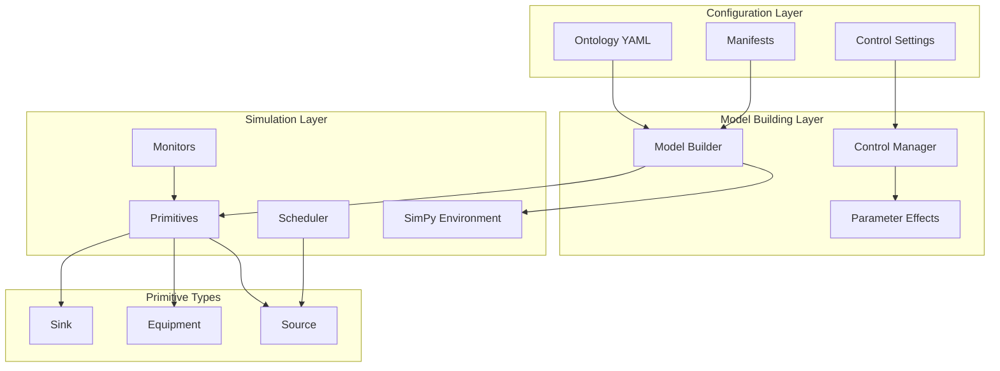
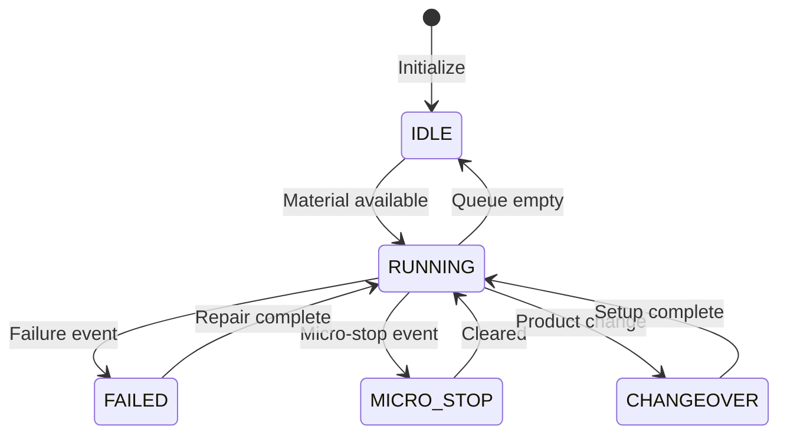

# Twin Model Architecture

## Overview

The Virtual Twin Model is a discrete-event simulation system built on SimPy that models production line operations with realistic equipment behavior, failure patterns, and control system interactions. It provides a digital representation of manufacturing processes for optimization, what-if analysis, and predictive insights.

## Core Design Philosophy

### 1. Ontology-Driven Architecture
The system uses an ontology (TBox/RBox structure) to define the conceptual model and relationships. This allows:
- Separation of domain knowledge from implementation
- Flexible configuration through manifests
- Consistent entity relationships across the system
- Easy extension without code changes

### 2. Direct Equipment Connections (No Buffer Pattern)
Unlike traditional approaches with separate buffer entities, our architecture uses:
- Internal queues within equipment primitives
- Direct equipment-to-equipment material flow
- Simplified state management
- Realistic representation of production lines

### 3. Two-Layer Control System
Plant manager controls affect simulation behavior through a mapping layer:
```
Actionable Controls → Parameter Mappings → Simulation Behavior
```
This provides intuitive control without exposing internal complexity.

## System Architecture Layers



## Component Descriptions

### 1. Configuration Layer

#### Ontology (twin_ontology.yaml)
- **TBox**: Defines classes and relationships (Equipment, Source, Sink, etc.)
- **RBox**: Defines rules and constraints
- **Entity Definitions**: Specific instances with properties

#### Manifests Directory
- `system_config.yaml`: Global simulation settings
- `production_manifest.yaml`: Line configurations
- `equipment_manifest.yaml`: Equipment specifications
- `scheduler_manifest.yaml`: Product definitions and scheduling
- `control_settings.yaml`: Initial control values

### 2. Model Building Layer

#### Model Builder (model_builder.py)
Responsible for:
- Loading and parsing ontology
- Creating primitive instances
- Wiring equipment connections
- Applying control parameters
- Starting simulation processes

#### Control Manager (control_manager.py)
Manages:
- Actionable control values
- Control-to-parameter mappings
- Parameter calculations
- Dynamic control updates

#### Parameter Effects (parameter_effects.py)
Handles:
- Parameter impact on simulation
- Warning thresholds
- Optimization recommendations
- KPI relationships

### 3. Simulation Layer

#### SimPy Environment
- Event-driven simulation engine
- Time management
- Process scheduling
- Resource allocation

#### Primitives

##### Source Primitive (source.py)
- Material generation
- Order-driven or continuous modes
- Changeover execution
- Quality inspection at source
- Direct equipment feeding

##### Equipment Primitive (equipment_v2_fixed.py)
- Processing with internal queues
- State management (IDLE, RUNNING, FAILED, etc.)
- Failure generation (MTBF/MTTR patterns)
- Micro-stop handling
- Performance and quality factors

##### Sink Primitive (sink.py)
- Material collection
- KPI calculation
- Order completion tracking
- Line performance metrics

##### Scheduler Primitive (scheduler.py)
- Production order management
- Changeover optimization
- Product sequencing strategies
- Campaign mode support
- Multi-line coordination

#### Monitors (monitor.py)
- Real-time KPI tracking
- State duration monitoring
- Event observation
- Metric aggregation

## Data Flow

### 1. Material Flow
```
Source → Equipment₁ → Equipment₂ → ... → Equipmentₙ → Sink
```

Each equipment has:
- `input_queue`: Receives from upstream
- `output_queue`: Temporary holding for processed units
- Direct `put()` to downstream equipment's input queue

### 2. Control Flow
```
Control Value → Mapping Function → Parameter Value → Primitive Behavior
```

Example:
```python
operator_training_hours: 40 
→ logarithmic mapping 
→ performance_factor: 1.15 
→ 15% speed improvement
```

### 3. Order Flow
```
Scheduler → Source (order dispatch) → Production → Sink (completion)
```

## State Management

### Equipment States
- **IDLE**: No material to process
- **RUNNING**: Active processing
- **FAILED**: Major failure requiring repair
- **MICRO_STOP**: Brief jam or issue
- **SCHEDULED_MAINTENANCE**: Planned downtime
- **UNSCHEDULED_MAINTENANCE**: Breakdown repair
- **CHANGEOVER**: Product switching

### State Transitions


## Event System

### Observable Events
Each primitive emits events that can be observed:

- **Source Events**: `unit_generated`, `order_started`, `changeover_started`
- **Equipment Events**: `state_change`, `unit_processed`, `failure_occurred`
- **Sink Events**: `unit_completed`, `order_completed`, `kpi_update`
- **Scheduler Events**: `order_dispatched`, `changeover_requested`

### Event Subscription
```python
# Subscribe to equipment state changes
equipment.observables['state_change'].append(callback_function)
```

## Performance Considerations

### 1. Queue Management
- Internal queues sized appropriately (default: 20 units)
- No infinite buffers to prevent memory issues
- Blocking behavior models real equipment constraints

### 2. Event Scheduling
- Efficient use of SimPy's event queue
- Minimal timeout events for state checking
- Process yielding for cooperative multitasking

### 3. Failure Generation
- Exponential distribution for realistic patterns
- Warmup period before failure activation
- Configurable MTBF/MTTR per equipment

## Extension Points

### 1. Adding New Primitives
1. Inherit from `BasePrimitive`
2. Implement `run()` generator method
3. Define observable events
4. Add to model builder's primitive creation

### 2. Adding New Controls
1. Define control in `control_settings.yaml`
2. Add mapping in `control_mappings.yaml`
3. Implement parameter effect in target primitive
4. Update documentation

### 3. Custom Scheduling Strategies
1. Extend `SequencingStrategy` enum
2. Implement strategy in scheduler's `_sequence_orders()`
3. Configure in scheduler manifest

## Integration with External Systems

### 1. MES Integration (Future)
- Real-time data ingestion
- Order synchronization
- Production feedback

### 2. Visualization
- Event stream for dashboards
- KPI export for analytics
- State timeline visualization

### 3. Optimization Engines
- Parameter sweep capabilities
- Scenario comparison
- Automated recommendation generation

## Key Design Decisions

### 1. Why No Separate Buffers?
- Real equipment has internal queues, not separate buffers
- Simplifies model complexity
- Reduces state synchronization issues
- More accurate representation

### 2. Why Two-Layer Control?
- Plant managers think in terms of actions (training, maintenance)
- Simulation needs technical parameters (MTBF, performance)
- Mapping layer provides translation

### 3. Why Ontology-Driven?
- Separates domain knowledge from code
- Enables configuration without programming
- Supports multiple deployment scenarios
- Facilitates model validation

## Common Patterns

### 1. Equipment Chain Pattern
```python
# Equipment wired in sequence
source → filler → capper → labeler → packer → sink
```

### 2. Control Feedback Pattern
```python
# Monitor KPIs → Adjust controls → Observe impact
monitor.get_kpi() → control_mgr.optimize() → measure_improvement()
```

### 3. Campaign Optimization Pattern
```python
# Group similar products → Minimize changeovers → Maximize throughput
scheduler.strategy = "campaign_mode"
```

## Summary

The Virtual Twin Model architecture provides:
- **Flexibility** through ontology-driven configuration
- **Realism** through direct equipment connections and failure modeling
- **Usability** through intuitive control mappings
- **Extensibility** through well-defined interfaces
- **Performance** through efficient event-driven simulation

This architecture enables accurate modeling of production systems while maintaining simplicity and configurability.