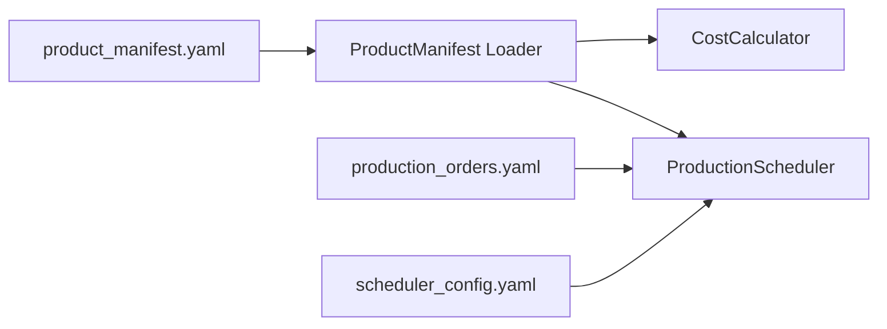
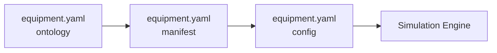
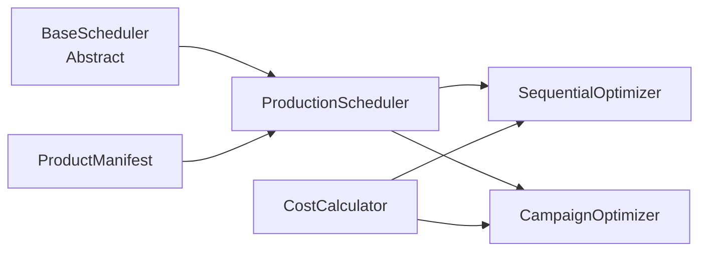

# Configuration Overview

This document describes how the various configuration files and manifests work together in the Virtual Ontology twin model system.

## Architecture Overview

The system follows a three-layer configuration architecture:

1. **Ontology** - Defines structure and relationships (schemas)
2. **Manifest** - Defines instances and their specific attributes  
3. **Config** - Defines runtime parameters and operational settings

## Configuration Files and Their Relationships

### Core Equipment Configuration
```
ontology/equipment.yaml     → Equipment class definitions (Container, Store types)
manifest/equipment.yaml     → Equipment instances (Line1, Line2, Line3)
config/equipment.yaml       → Equipment parameters (speeds, capacities)
```

### Product Configuration
```
config/product_manifest.yaml    → Comprehensive product specifications
                                  - Physical attributes (dimensions, weight)
                                  - Production capabilities (rates, efficiency)
                                  - Economics (costs, pricing)
                                  - Changeover matrices
                                  - Quality specifications
                                  - Inventory parameters
```

### Scheduling Configuration
```
config/scheduler_config.yaml    → Scheduler behavior and constraints
                                  - Duration parameters
                                  - Changeover times
                                  - Optimization objectives
                                  - Algorithm selection
                                  
config/production_orders.yaml   → Production order patterns
                                  - Product definitions (simplified)
                                  - Line product mix
                                  - Order generation parameters
                                  - Shift patterns
```

### MES Data Collection
```
config/mes_parameters.yaml      → MES system configuration
                                  - Collection intervals
                                  - OEE thresholds
                                  - Reason codes
                                  - Metric definitions
```

## Data Flow and Dependencies

### 1. Product Definition Flow


### 2. Equipment Configuration Flow


### 3. Scheduling Decision Flow


## Key Configuration Relationships

### Product to Line Mapping
- **product_manifest.yaml**: Defines which lines can produce each product and their efficiency
- **production_orders.yaml**: Defines the product mix for each line
- **scheduler_config.yaml**: Defines compatibility constraints

### Cost Calculation Dependencies
1. **Base Costs**: From `product_manifest.yaml` economics section
2. **Changeover Costs**: From `product_manifest.yaml` changeover matrices
3. **Inventory Costs**: From `product_manifest.yaml` inventory section
4. **Quality Costs**: From `product_manifest.yaml` quality section
5. **Labor/Energy**: From `product_manifest.yaml` resource consumption

### Scheduling Constraints
- **Time Windows**: `scheduler_config.yaml` defines maintenance windows
- **Sequence Rules**: `scheduler_config.yaml` defines forbidden/preferred sequences
- **Campaign Limits**: `scheduler_config.yaml` defines min/max campaign lengths
- **Product Capabilities**: `product_manifest.yaml` defines production rates

## Configuration Validation

### Required Consistency Checks
1. **Product IDs** must match across:
   - `product_manifest.yaml`
   - `production_orders.yaml`
   - `scheduler_config.yaml` (compatibility sections)

2. **Line IDs** must match across:
   - `manifest/equipment.yaml`
   - `product_manifest.yaml` (line_efficiency)
   - `production_orders.yaml` (line_product_mix)

3. **Changeover Groups** must be consistent:
   - `product_manifest.yaml` (product groups)
   - `scheduler_config.yaml` (changeover times reference these)

## Usage Patterns

### Loading Product Information
```python
from twin_model.scheduling.product_manifest import ProductManifest

# Load comprehensive product data
manifest = ProductManifest.from_yaml('config/product_manifest.yaml')

# Get product details
product = manifest.get_product('SKU-1001')
changeover_cost = manifest.get_changeover_cost('SKU-1001', 'SKU-2001')
line_efficiency = manifest.get_line_efficiency('SKU-1001', 'Line1')
```

### Creating a Scheduler
```python
from twin_model.scheduling.production_scheduler import ProductionScheduler
from twin_model.scheduling.cost_calculator import ProductionCostCalculator

# Load configurations
scheduler_config = load_yaml('config/scheduler_config.yaml')
product_manifest = ProductManifest.from_yaml('config/product_manifest.yaml')

# Create scheduler with cost optimization
scheduler = ProductionScheduler(
    config=scheduler_config,
    product_manifest=product_manifest
)

# Create cost calculator
calculator = ProductionCostCalculator(product_manifest)

# Generate and optimize schedule
orders = scheduler.generate_orders(...)
initial_schedule = scheduler.generate_schedule(orders)
optimized_schedule = scheduler.optimize_schedule(initial_schedule, calculator)
```

### MES Data Collection
```python
from twin_model.transduction.mes_collector import MESDataCollector

# Load MES configuration
mes_config = load_yaml('config/mes_parameters.yaml')

# Create collector
collector = MESDataCollector(env, mes_config)

# Register equipment
collector.register_equipment(line1)
collector.register_equipment(line2)

# Start collection (runs as SimPy process)
env.process(collector.collect_data())
```

## Configuration Best Practices

### 1. Use Configuration Hierarchy
- **Ontology**: Structure that rarely changes
- **Manifest**: Instances that change occasionally  
- **Config**: Parameters that change frequently

### 2. Maintain Referential Integrity
- Always validate cross-references between configs
- Use consistent naming conventions (e.g., SKU-XXXX for products)
- Document any dependencies in comments

### 3. Version Control
- Track all configuration changes in git
- Use semantic versioning in metadata sections
- Document breaking changes in CHANGELOG.md

### 4. Testing
- Test configuration loading before simulation
- Validate all cross-references
- Check for missing required fields
- Ensure numeric parameters are within valid ranges

## Common Configuration Tasks

### Adding a New Product
1. Add full specification to `config/product_manifest.yaml`
2. Add simplified version to `config/production_orders.yaml` 
3. Update line compatibility in `config/scheduler_config.yaml`
4. Update line product mix if needed

### Modifying Changeover Rules
1. Update changeover matrices in `config/product_manifest.yaml`
2. Update time parameters in `config/scheduler_config.yaml`
3. Update sequence constraints if needed

### Adjusting Production Rates
1. Update target rates in `config/product_manifest.yaml`
2. Update line efficiency matrix if needed
3. Consider updating order generation parameters

## Troubleshooting

### Common Issues
1. **KeyError on product lookup**: Check product ID consistency
2. **Invalid schedule**: Verify line-product compatibility
3. **Zero costs**: Check product manifest economics section
4. **Missing changeover times**: Verify changeover group assignments

### Validation Commands
```bash
# Validate all configurations
~/.local/bin/poetry run python scripts/validate_configs.py

# Check specific manifest
~/.local/bin/poetry run python -m twin_model.scheduling.product_manifest --validate config/product_manifest.yaml

# Test scheduler with configs
~/.local/bin/poetry run pytest tests/test_scheduler_config.py
```

## Future Enhancements

### Planned Configuration Extensions
1. **Dynamic pricing models** in product manifest
2. **Multi-site configuration** support
3. **Recipe management** for complex products
4. **Supplier constraints** in scheduling
5. **Environmental parameters** (carbon costs, sustainability metrics)

### Configuration Management Tools
- Configuration validation CLI
- Interactive configuration editor
- Configuration diff and merge tools
- Automated consistency checker