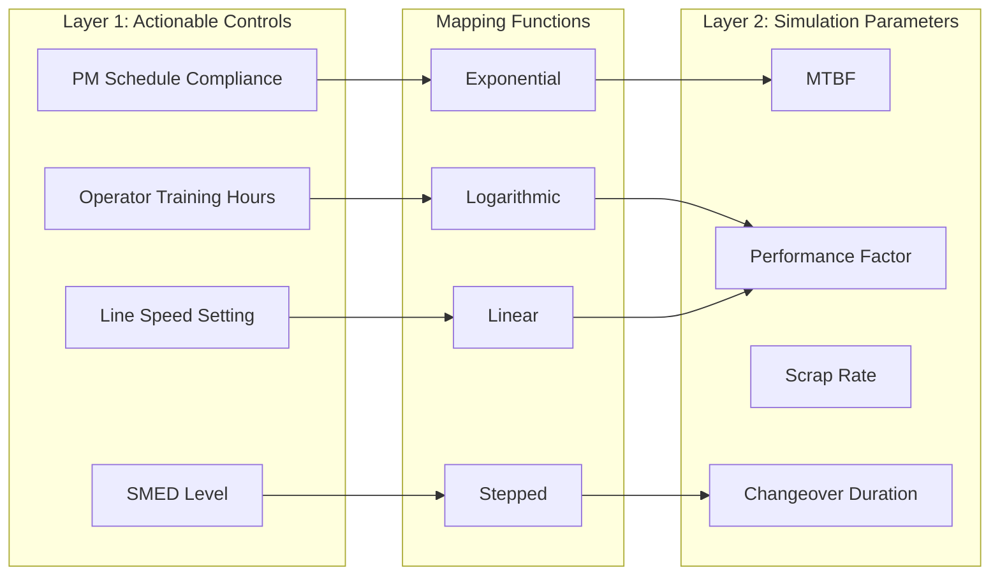
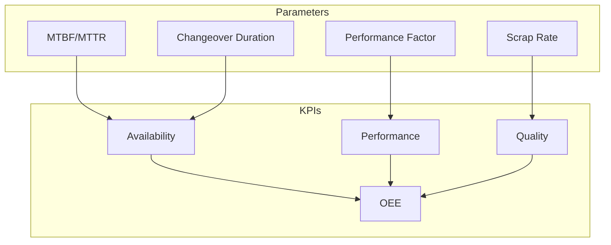

# Control System Guide

## Overview

The Virtual Twin Model implements a two-layer control system that translates plant manager actions into simulation parameters. This guide explains how controls work, how to configure mappings, and how to optimize system performance through control adjustments.

## Two-Layer Architecture



### Layer 1: Actionable Controls
What plant managers can directly influence:
- Training programs
- Maintenance schedules
- Operating speeds
- Process improvements

### Layer 2: Simulation Parameters
Technical parameters that affect simulation:
- Failure rates (MTBF/MTTR)
- Processing speeds
- Quality metrics
- Changeover times

## Control Definitions

### Control Settings File
```yaml
# manifests/control_settings.yaml
metadata:
  version: "1.0.0"
  description: "Plant manager actionable controls"

controls:
  operator_training_hours:
    description: "Operator training investment"
    type: "numeric"
    unit: "hours"
    range: [0, 80]
    default: 8
    current: 8
    
  pm_schedule_compliance:
    description: "Preventive maintenance adherence"
    type: "percentage"
    unit: "%"
    range: [0, 100]
    default: 60
    current: 60
    
  changeover_reduction_level:
    description: "SMED implementation level"
    type: "categorical"
    options: [0, 1, 2]  # None, Basic, Advanced
    default: 0
    current: 0
```

## Mapping Functions

### 1. Linear Mapping
Simple proportional relationship:
```python
output = base + coefficient * input
```

Example:
```yaml
line_speed_setting:
  affects:
    performance_factor:
      function: "linear"
      base: 0.0
      coefficient: 0.01  # 1% per unit
      min: 0.7
      max: 1.3
```

### 2. Exponential Mapping
Rapid growth or decay:
```python
output = base * exp(coefficient * input)
```

Example:
```yaml
pm_schedule_compliance:
  affects:
    mtbf:
      function: "exponential"
      base: 1.0
      coefficient: 0.01  # ~60% improvement at 100%
      max: 1.6
```

### 3. Logarithmic Mapping
Diminishing returns:
```python
output = base * (1 + coefficient * log(1 + input))
```

Example:
```yaml
operator_training_hours:
  affects:
    performance_factor:
      function: "logarithmic"
      base: 1.0
      coefficient: 0.05  # Gradual improvement
```

### 4. Stepped Mapping
Discrete levels:
```python
for i, threshold in enumerate(thresholds):
    if input <= threshold:
        return values[i]
```

Example:
```yaml
changeover_reduction_level:
  affects:
    changeover_duration:
      function: "stepped"
      thresholds: [0, 1, 2]
      values: [1.0, 0.5, 0.3]  # 0%, 50%, 70% reduction
```

### 5. Sigmoid Mapping (S-Curve)
Gradual transition between states:
```python
output = max_value / (1 + exp(-steepness * (input - midpoint)))
```

Example:
```yaml
sensor_coverage:
  affects:
    defect_detection_rate:
      function: "sigmoid"
      max: 0.98
      steepness: 0.1
      midpoint: 50
```

## Control Mappings Configuration

### Structure
```yaml
# ontology/control_mappings.yaml
metadata:
  name: "Control to Parameter Mappings"
  version: "1.0.0"

# Base values for simulation parameters
simulation_parameters:
  mtbf:
    base_value: 240
    unit: "minutes"
  performance_factor:
    base_value: 1.0
    unit: "multiplier"

# Control effect definitions
control_mappings:
  operator_training_hours:
    affects:
      micro_stop_recovery_time:
        function: "exponential"
        base: 1.0
        coefficient: -0.02
        min: 0.6
        description: "Trained operators clear jams faster"
      
      scrap_rate:
        function: "linear"
        base: 1.0
        coefficient: -0.005
        min: 0.8
        description: "Training improves quality"
```

## Parameter Effects

### Parameter Impact on KPIs



### Key Parameter Relationships

1. **MTBF/MTTR → Availability**
   ```
   Availability = MTBF / (MTBF + MTTR)
   ```

2. **Performance Factor → Performance**
   ```
   Performance = Actual Rate / Ideal Rate * Performance Factor
   ```

3. **Scrap Rate → Quality**
   ```
   Quality = Good Units / Total Units = 1 - Scrap Rate
   ```

4. **OEE Calculation**
   ```
   OEE = Availability × Performance × Quality
   ```

## Control Manager Implementation

### Initialization
```python
from twin_model.control.control_manager import ControlManager

control_mgr = ControlManager(
    ontology_path="ontology/twin_ontology.yaml",
    mappings_path="ontology/control_mappings.yaml",
    settings_path="manifests/control_settings.yaml"
)
```

### Setting Control Values
```python
# Set individual control
control_mgr.set_control_value('operator_training_hours', 40)

# Set multiple controls
controls = {
    'operator_training_hours': 40,
    'pm_schedule_compliance': 80,
    'changeover_reduction_level': 1
}
control_mgr.set_control_values(controls)
```

### Getting Parameter Values
```python
# Get computed parameter value
mtbf_multiplier = control_mgr.get_parameter_value('mtbf')

# Get all parameters
all_params = control_mgr.get_all_parameters()
```

## Control Optimization Strategies

### 1. Quick Wins Strategy
Focus on low-cost, high-impact controls:
```python
quick_wins = {
    'operator_training_hours': 16,  # Minimal training
    'sensor_coverage': 60,          # Basic monitoring
    'data_collection_frequency': 15  # Standard logging
}
```

### 2. Balanced Strategy
Moderate investment across all areas:
```python
balanced = {
    'operator_training_hours': 40,
    'pm_schedule_compliance': 75,
    'line_speed_setting': 90,
    'changeover_reduction_level': 1
}
```

### 3. Optimized Strategy
Maximum performance focus:
```python
optimized = {
    'operator_training_hours': 60,
    'pm_schedule_compliance': 95,
    'autonomous_maintenance_level': 2,
    'changeover_reduction_level': 2,
    'sensor_coverage': 90
}
```

## Adding New Controls

### Step 1: Define Control
```yaml
# In control_settings.yaml
new_control_name:
  description: "What this control represents"
  type: "numeric"  # or "categorical"
  unit: "units"
  range: [min, max]
  default: value
  current: value
```

### Step 2: Define Mapping
```yaml
# In control_mappings.yaml
new_control_name:
  affects:
    target_parameter:
      function: "linear"  # Choose appropriate function
      base: 1.0
      coefficient: 0.01
      min: 0.5
      max: 2.0
      description: "How control affects parameter"
```

### Step 3: Implement Effect
```python
# In target primitive
def apply_control_parameters(self, control_params):
    if 'target_parameter' in control_params:
        self.parameter = self.base_value * control_params['target_parameter']
```

## Control Validation

### Range Validation
```python
def validate_control_value(control_name, value):
    control_def = controls[control_name]
    min_val, max_val = control_def['range']
    
    if value < min_val or value > max_val:
        raise ValueError(f"{control_name} must be between {min_val} and {max_val}")
```

### Effect Validation
```python
def validate_parameter_effect(param_name, value):
    if param_name == 'mtbf' and value < 60:
        warnings.warn("MTBF below 60 minutes may cause excessive failures")
    
    if param_name == 'performance_factor' and value > 1.5:
        warnings.warn("Performance factor > 1.5 may be unrealistic")
```

## Warning Thresholds

### Parameter Warnings
```python
# In parameter_effects.py
warnings = {
    'mtbf': {
        'low': 120,  # < 2 hours
        'message': "Frequent failures expected"
    },
    'changeover_duration': {
        'high': 45,  # > 45 minutes
        'message': "Long changeovers impact availability"
    },
    'scrap_rate': {
        'high': 0.05,  # > 5%
        'message': "High scrap affects profitability"
    }
}
```

## Testing Control Effects

### Unit Testing
```python
def test_linear_mapping():
    result = apply_mapping(
        value=50,
        mapping={'function': 'linear', 'base': 1.0, 'coefficient': 0.01}
    )
    assert result == 1.5  # 1.0 + 0.01 * 50
```

### Integration Testing
```python
def test_control_to_kpi():
    # Set control
    control_mgr.set_control_value('operator_training_hours', 40)
    
    # Run simulation
    env.run(until=480)
    
    # Check KPI improvement
    assert kpi['oee'] > baseline_oee
```

## Best Practices

### 1. Control Naming
- Use descriptive names: `operator_training_hours` not `training`
- Include units in name when helpful: `compliance_percentage`
- Use consistent naming patterns

### 2. Mapping Design
- Start with simple functions (linear, stepped)
- Use exponential for strong effects
- Use logarithmic for diminishing returns
- Document reasoning for function choice

### 3. Parameter Ranges
- Set realistic min/max bounds
- Consider physical constraints
- Validate against industry benchmarks
- Test edge cases

### 4. Documentation
- Always include descriptions
- Document units clearly
- Explain the business impact
- Provide usage examples

## Common Patterns

### 1. Training Impact Pattern
Training affects multiple parameters with diminishing returns:
```yaml
operator_training_hours:
  affects:
    performance_factor: logarithmic
    scrap_rate: linear
    micro_stop_recovery: exponential
```

### 2. Maintenance Impact Pattern
Maintenance primarily affects reliability:
```yaml
pm_schedule_compliance:
  affects:
    mtbf: exponential
    mttr: linear
    equipment_lifetime: logarithmic
```

### 3. Speed-Quality Tradeoff
Higher speeds may reduce quality:
```yaml
line_speed_setting:
  affects:
    performance_factor: linear (positive)
    scrap_rate: exponential (negative)
    micro_stop_frequency: polynomial
```

## Troubleshooting

### Issue: Control Not Affecting Simulation
1. Check mapping exists in `control_mappings.yaml`
2. Verify primitive implements parameter
3. Ensure control manager is initialized
4. Check parameter is being applied

### Issue: Unexpected Parameter Values
1. Review mapping function and coefficients
2. Check for min/max constraints
3. Verify base parameter values
4. Test mapping in isolation

### Issue: Poor KPI Results
1. Review control combinations
2. Check for conflicting effects
3. Analyze bottlenecks
4. Consider system constraints

## Summary

The control system provides:
- **Intuitive Interface**: Plant manager-friendly controls
- **Flexible Mappings**: Various function types for different relationships
- **Realistic Effects**: Based on industry research
- **Optimization Support**: Strategies for improvement
- **Extensibility**: Easy to add new controls and mappings

This architecture bridges the gap between operational decisions and technical simulation parameters, enabling effective what-if analysis and optimization.