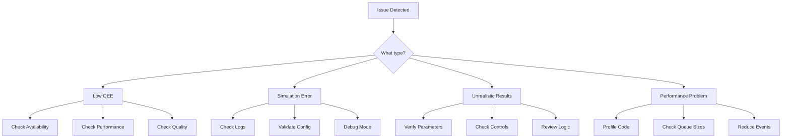

# Troubleshooting Guide

## Overview

This guide helps diagnose and resolve common issues with the Virtual Twin Model simulation. Problems are organized by category with symptoms, causes, and solutions.

## Quick Diagnosis Flowchart



## Common Issues and Solutions

### 1. Low OEE Values

#### Symptom: OEE Below Expected (< 40%)

**Check Availability:**
```python
# Debug availability issues
def diagnose_availability(sink):
    total_time = env.now
    equipment_states = {}
    
    for equipment in production_line:
        states = equipment.state_durations
        running_time = states.get(EquipmentState.RUNNING, 0)
        availability = running_time / total_time
        
        print(f"{equipment.id}: {availability:.1%}")
        print(f"  Failed: {states.get(EquipmentState.FAILED, 0):.1f} min")
        print(f"  Micro-stops: {equipment.micro_stop_count}")
```

**Common Causes:**
- MTBF too low (< 60 minutes)
- MTTR too high (> 30 minutes)
- Excessive micro-stops
- Missing warmup period

**Solutions:**
```python
# Adjust reliability parameters
equipment.mtbf_base = 240  # Reasonable MTBF
equipment.mttr_base = 15   # Quick repairs
equipment.micro_stop_frequency_base = 0.02  # 2% chance

# Enable warmup period
equipment.warmup_time = 60  # No failures first hour
```

#### Symptom: OEE Too High (> 95%)

**Common Causes:**
- Failures not triggering
- Quality always perfect
- No changeovers modeled

**Solutions:**
```python
# Verify failure generation is running
assert equipment.failure_process is not None
assert equipment.warmup_complete == True

# Check quality implementation
assert equipment.scrap_rate_base > 0
assert random.random() < quality_rate  # Should fail sometimes
```

### 2. Simulation Errors

#### Error: "AttributeError: 'NoneType' object has no attribute 'put'"

**Cause:** Missing downstream connection

**Solution:**
```python
# Check wiring
def verify_connections(production_line):
    for i, equipment in enumerate(production_line[:-1]):
        downstream = production_line[i + 1]
        assert equipment.downstream is not None
        assert equipment.downstream == downstream.input_queue
```

#### Error: "Queue full, cannot put unit"

**Cause:** Queue overflow due to downstream bottleneck

**Solution:**
```python
# Increase queue sizes
equipment.input_queue = simpy.Store(env, capacity=50)  # Was 20

# Or implement blocking behavior
if len(self.output_queue.items) >= self.output_queue.capacity:
    self._change_state(EquipmentState.BLOCKED)
    yield self.env.timeout(0.1)
    continue
```

#### Error: "Generator already executing"

**Cause:** Multiple processes trying to modify same generator

**Solution:**
```python
# Use separate processes
self.main_process = env.process(self.run())
self.failure_process = env.process(self._generate_failures())
# Don't call failure generation from run()
```

### 3. Material Flow Issues

#### Symptom: Equipment Starved Despite Upstream Production

**Diagnostic:**
```python
def check_material_flow():
    for equipment in production_line:
        print(f"{equipment.id}:")
        print(f"  Input queue: {len(equipment.input_queue.items)}")
        print(f"  Output queue: {len(equipment.output_queue.items)}")
        print(f"  State: {equipment.state}")
        print(f"  Units processed: {equipment.units_processed}")
```

**Common Causes:**
- Broken connection chain
- Processing rate mismatch
- Quality rejection too high

**Solutions:**
```python
# Verify connection chain
source → equipment1 → equipment2 → sink

# Balance processing rates
upstream_rate = 100  # units/min
downstream_rate = 80  # units/min
# Need buffer or upstream throttling

# Check quality cascade
total_quality = 0.98 * 0.97 * 0.96  # Compounds through line
```

#### Symptom: Excessive WIP (Work in Progress)

**Common Causes:**
- Queues too large
- No flow control
- Bottleneck not managed

**Solutions:**
```python
# Implement pull system
if downstream.input_queue.capacity - len(downstream.input_queue.items) > 0:
    # Produce
else:
    # Wait

# Limit WIP
max_wip = 100
current_wip = sum(len(eq.input_queue.items) for eq in line)
if current_wip > max_wip:
    source.pause_generation()
```

### 4. Control System Issues

#### Symptom: Controls Not Affecting Simulation

**Diagnostic:**
```python
def verify_control_effect():
    # Set control
    control_mgr.set_control_value('operator_training_hours', 40)
    
    # Check parameter
    param = control_mgr.get_parameter_value('performance_factor')
    print(f"Performance factor: {param}")
    
    # Check primitive
    equipment = model['primitives']['LINE1-FIL']
    print(f"Equipment performance: {equipment.performance_factor}")
```

**Common Causes:**
- Mapping not defined
- Parameter not applied
- Wrong parameter name

**Solutions:**
```python
# Verify mapping exists
assert 'operator_training_hours' in control_mappings
assert 'performance_factor' in control_mappings['operator_training_hours']['affects']

# Apply parameters
def apply_control_parameters(self, params):
    if 'performance_factor' in params:
        self.performance_factor = self.performance_factor_base * params['performance_factor']
```

### 5. Changeover Issues

#### Symptom: No Changeovers Occurring

**Common Causes:**
- Same product continuously
- Changeover check missing
- Order mode disabled

**Solutions:**
```python
# Ensure product variety
orders = [
    ProductionOrder(product=products['SKU-1001'], ...),
    ProductionOrder(product=products['SKU-2001'], ...),  # Different
]

# Check changeover trigger
if self.last_product != order.product.product_id:
    self.is_changing_over = True
    yield from self._execute_changeover()
```

#### Symptom: Excessive Changeover Time

**Common Causes:**
- Matrix values too high
- No SMED reduction
- Too many product switches

**Solutions:**
```python
# Review changeover matrix
for i, j in product_pairs:
    time = changeover_matrix[i, j]
    assert time <= 60  # Max 1 hour

# Apply SMED
if smed_level > 0:
    changeover_time *= [1.0, 0.5, 0.3][smed_level]

# Use campaign mode
scheduler.strategy = "campaign_mode"
```

### 6. Performance Issues

#### Symptom: Simulation Runs Slowly

**Diagnostic:**
```python
import cProfile
import pstats

profiler = cProfile.Profile()
profiler.enable()

env.run(until=480)

profiler.disable()
stats = pstats.Stats(profiler)
stats.sort_stats('cumulative')
stats.print_stats(20)
```

**Common Causes:**
- Too many events
- Inefficient loops
- Large queues

**Solutions:**
```python
# Reduce event frequency
self.emit_observable("state_change", data)  # Only on change
# Not: self.emit_observable("state", data)  # Every timeout

# Efficient timeout patterns
yield self.env.timeout(1)  # Not too small
# Not: yield self.env.timeout(0.001)

# Limit queue sizes
simpy.Store(env, capacity=50)  # Not unlimited
```

### 7. Validation Issues

#### Symptom: Results Don't Match Reality

**Validation Checklist:**
```python
def validate_parameters():
    checks = {
        "MTBF realistic": mtbf >= 60 and mtbf <= 10000,
        "MTTR reasonable": mttr >= 5 and mttr <= 60,
        "Scrap rate normal": scrap_rate >= 0.001 and scrap_rate <= 0.1,
        "Speed achievable": performance_rate <= 150,
        "Queue sizes practical": queue_capacity >= 5 and queue_capacity <= 100
    }
    
    for check, result in checks.items():
        print(f"{check}: {'✓' if result else '✗'}")
```

## Debugging Techniques

### 1. Enable Debug Logging

```python
import logging

logging.basicConfig(
    level=logging.DEBUG,
    format='%(asctime)s - %(name)s - %(levelname)s - %(message)s'
)

logger = logging.getLogger(__name__)
```

### 2. Add Breakpoints

```python
def _process_unit(self):
    # Debug specific condition
    if self.units_processed > 100 and self.state == EquipmentState.FAILED:
        import pdb; pdb.set_trace()
    
    # Continue processing
    ...
```

### 3. Event Tracing

```python
def trace_events(env, callback):
    """Trace all simulation events"""
    def wrapper(env_step, callback):
        def tracing_step():
            if len(env._queue):
                t, prio, eid, event = env._queue[0]
                callback(t, prio, eid, event)
            return env_step()
        return tracing_step
    
    env.step = wrapper(env.step, callback)
```

### 4. State Inspection

```python
def inspect_system_state(env, model):
    """Snapshot of system state"""
    print(f"\n=== System State at t={env.now:.1f} ===")
    
    for prim_id, primitive in model['primitives'].items():
        if hasattr(primitive, 'state'):
            print(f"{prim_id}: {primitive.state}")
            print(f"  Queue: {len(primitive.input_queue.items)}")
            print(f"  Processed: {primitive.units_processed}")
```

## Configuration Validation

### Validate Ontology

```python
def validate_ontology(ontology_path):
    """Check ontology structure"""
    ontology = load_yaml(ontology_path)
    
    assert 'tbox' in ontology
    assert 'rbox' in ontology
    assert 'entities' in ontology
    
    # Check relationships
    for rel in ontology['rbox']['relationships']:
        assert 'domain' in rel
        assert 'range' in rel
        assert 'cardinality' in rel
```

### Validate Manifests

```python
def validate_manifests(manifest_dir):
    """Check manifest consistency"""
    manifests = load_all_manifests(manifest_dir)
    
    # Check required files
    required = ['system_config', 'production_manifest', 'equipment_manifest']
    for req in required:
        assert f"{req}.yaml" in manifests
    
    # Check entity references
    all_entities = merge_entities(manifests)
    for entity_id, entity in all_entities.items():
        if 'line_id' in entity.properties:
            assert entity.properties['line_id'] in all_entities
```

## Recovery Procedures

### Reset Simulation State

```python
def reset_simulation():
    """Clean reset for new run"""
    # Create new environment
    env = simpy.Environment()
    
    # Reload configuration
    control_mgr = ControlManager(...)
    control_mgr.reset_to_defaults()
    
    # Rebuild model
    builder = ModelBuilder(env, ...)
    model = builder.build_model()
    
    return env, model
```

### Restore from Checkpoint

```python
def checkpoint_simulation(env, model, filepath):
    """Save simulation state"""
    state = {
        'time': env.now,
        'primitives': {},
        'controls': control_mgr.get_all_controls()
    }
    
    for prim_id, primitive in model['primitives'].items():
        state['primitives'][prim_id] = {
            'state': primitive.state,
            'units_processed': primitive.units_processed,
            'state_durations': dict(primitive.state_durations)
        }
    
    save_pickle(state, filepath)
```

## Getting Help

### Log Collection

```bash
# Collect debug information
python collect_debug_info.py --output debug_bundle.zip

# Include:
# - Configuration files (ontology, manifests)
# - Recent log files
# - System information
# - Error traces
```

### Minimal Reproducible Example

```python
def create_minimal_example():
    """Minimal setup to reproduce issue"""
    env = simpy.Environment()
    
    # Minimal configuration
    config = PrimitiveConfig(
        id="TEST-EQ",
        properties={"mtbf_base": 60, "mttr_base": 30}
    )
    
    # Single equipment
    equipment = EquipmentPrimitiveV2(env, config)
    
    # Run and observe issue
    env.run(until=100)
    
    print(f"Issue reproduced: {equipment.failure_count}")
```

## Summary

Effective troubleshooting requires:
- **Systematic Diagnosis**: Use flowcharts and checklists
- **Proper Validation**: Check parameters and connections
- **Good Instrumentation**: Add logging and tracing
- **Incremental Testing**: Isolate issues in minimal examples
- **Documentation**: Record issues and solutions

This guide covers the most common issues, but complex simulations may have unique challenges. When in doubt, start with validation and work systematically through the components.