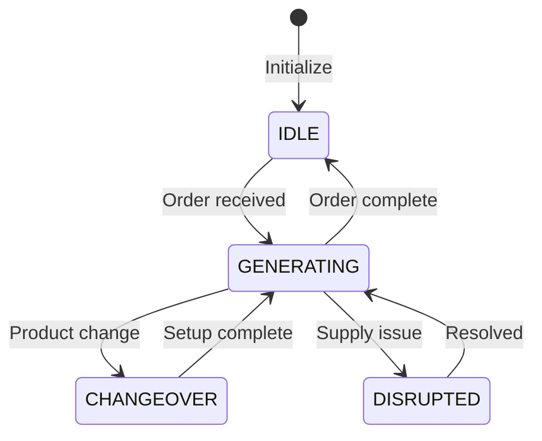
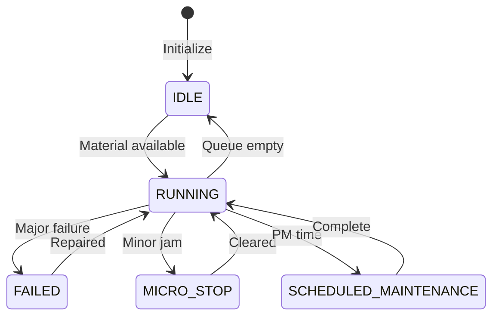

# Primitive Reference

## Overview

Primitives are the fundamental building blocks of the Virtual Twin Model simulation. Each primitive represents a distinct component in the production system with specific behavior and interactions. This reference provides detailed specifications for all primitive types.

## Base Primitive

All primitives inherit from `BasePrimitive`:

```python
class BasePrimitive:
    def __init__(self, env, config, sampling_config=None):
        self.env = env  # SimPy environment
        self.config = config  # PrimitiveConfig
        self.sampling_config = sampling_config
        self.observables = {}  # Event subscriptions
        self.process = None  # SimPy process
    
    def run(self):
        """Generator method - must be implemented by subclasses"""
        raise NotImplementedError
    
    def emit_observable(self, event_type, data):
        """Emit event to all subscribers"""
        if event_type in self.observables:
            for callback in self.observables[event_type]:
                callback(data)
```

## Source Primitive V2

### Purpose
Generates material/units and feeds them directly into production lines.

### File Location
`twin_model/primitives/source.py`

### Key Properties

| Property | Type | Default | Description |
|----------|------|---------|-------------|
| line_id | str | "LINE1" | Production line assignment |
| arrival_pattern | enum | CONSTANT | Generation pattern (CONSTANT, POISSON, BATCH) |
| arrival_rate | float | 85.0 | Units per minute |
| batch_size | int | 100 | Units per batch |
| order_mode | bool | True | Order-driven vs continuous |
| quality_rate | float | 0.95 | Initial quality inspection |
| supply_variability | float | 0.1 | Supply consistency |

### State Management



### Key Methods

```python
def set_production_order(self, order: ProductionOrder):
    """Assign production order and check for changeover"""
    
def _execute_changeover(self) -> Generator:
    """Execute product changeover with setup units"""
    
def _generate_unit(self) -> Generator:
    """Generate single unit with quality check"""
    
def _order_driven_generation(self) -> Generator:
    """Generate based on production orders"""
    
def _continuous_generation(self) -> Generator:
    """Generate continuously without orders"""
```

### Observable Events

- `unit_generated`: Unit successfully created
- `unit_rejected`: Quality check failed
- `order_started`: New order beginning
- `order_completed`: Order finished
- `changeover_started`: Changeover beginning
- `changeover_completed`: Changeover finished
- `supply_disruption`: Supply issue occurred

### Configuration Example

```yaml
LINE1-SRC:
  entity_class: "Source"
  properties:
    line_id: "LINE1"
    arrival_rate: 85
    arrival_pattern: "CONSTANT"
    order_mode: true
    quality_rate: 0.95
    batch_size: 100
```

## Equipment Primitive V2

### Purpose
Processes units with realistic equipment behavior including failures, performance variation, and quality impacts.

### File Location
`twin_model/primitives/equipment_v2_fixed.py`

### Key Properties

| Property | Type | Default | Description |
|----------|------|---------|-------------|
| equipment_type | str | required | Type (FILLER, PACKER, etc.) |
| processing_time_base | float | 0.5 | Seconds per unit |
| performance_rate | float | 85 | Units per minute |
| queue_capacity | int | 20 | Internal queue size |
| mtbf_base | float | 240 | Mean time between failures (min) |
| mttr_base | float | 15 | Mean time to repair (min) |
| micro_stop_frequency_base | float | 0.02 | Micro-stop probability |
| micro_stop_duration | float | 0.5 | Micro-stop length (min) |
| scrap_rate_base | float | 0.02 | Quality loss rate |

### States



### Internal Architecture

```python
class EquipmentPrimitiveV2:
    def __init__(self, ...):
        # Internal queues (NO SEPARATE BUFFERS!)
        self.input_queue = simpy.Store(env, capacity=queue_capacity)
        self.output_queue = simpy.Store(env, capacity=5)
        
        # State tracking
        self.state = EquipmentState.IDLE
        self.state_start_time = 0.0
        self.state_durations = defaultdict(float)
        
        # Performance tracking
        self.units_processed = 0
        self.units_scrapped = 0
        self.failure_count = 0
        self.micro_stop_count = 0
```

### Key Methods

```python
def run(self) -> Generator:
    """Main processing loop"""
    
def _process_unit(self, unit: ProductionUnit) -> Generator:
    """Process single unit with quality check"""
    
def _generate_failures(self) -> Generator:
    """Generate random failures based on MTBF"""
    
def _generate_micro_stops(self) -> Generator:
    """Generate minor stoppages"""
    
def _change_state(self, new_state: EquipmentState):
    """Update state and track duration"""
    
def apply_control_parameters(self, params: dict):
    """Apply control system effects"""
```

### Observable Events

- `state_change`: State transition occurred
- `unit_processed`: Unit successfully processed
- `unit_scrapped`: Unit failed quality
- `failure_occurred`: Major failure event
- `micro_stop_occurred`: Minor stoppage
- `maintenance_started`: Maintenance beginning
- `maintenance_completed`: Maintenance finished

### Configuration Example

```yaml
LINE1-FIL:
  entity_class: "Equipment"
  properties:
    equipment_type: "FILLER"
    line_id: "LINE1"
    processing_time_base: 0.5
    performance_rate: 85
    queue_capacity: 20
    mtbf_base: 240
    mttr_base: 15
    micro_stop_frequency_base: 0.02
    scrap_rate_base: 0.02
```

## Sink Primitive V2

### Purpose
Collects processed units, calculates KPIs, and tracks order completion.

### File Location
`twin_model/primitives/sink.py`

### Key Properties

| Property | Type | Default | Description |
|----------|------|---------|-------------|
| line_id | str | required | Production line |
| target_rate | float | 85 | Expected units/min |
| kpi_window | float | 60 | KPI calculation window (min) |

### KPI Calculations

```python
def calculate_kpis(self) -> dict:
    """Calculate OEE and component metrics"""
    
    # Availability
    availability = uptime / total_time
    
    # Performance  
    performance = actual_rate / ideal_rate
    
    # Quality
    quality = good_units / total_units
    
    # OEE
    oee = availability * performance * quality
    
    return {
        'oee': oee,
        'availability': availability,
        'performance': performance,
        'quality': quality,
        'total_units': total_units,
        'good_units': good_units
    }
```

### Key Methods

```python
def run(self) -> Generator:
    """Collect units and track metrics"""
    
def _update_order_tracking(self, unit: ProductionUnit):
    """Track order completion progress"""
    
def get_line_kpis(self) -> dict:
    """Get current KPI snapshot"""
    
def get_throughput(self) -> float:
    """Calculate current throughput rate"""
```

### Observable Events

- `unit_completed`: Unit reached end of line
- `order_completed`: Order fully processed
- `kpi_update`: Periodic KPI calculation
- `target_missed`: Production below target

### Configuration Example

```yaml
LINE1-SINK:
  entity_class: "Sink"
  properties:
    line_id: "LINE1"
    target_rate: 85
    kpi_window: 60
```

## Scheduler Primitive V2

### Purpose
Manages production orders, optimizes sequencing, and coordinates changeovers across lines.

### File Location
`twin_model/primitives/scheduler.py`

### Key Properties

| Property | Type | Default | Description |
|----------|------|---------|-------------|
| sequencing_strategy | enum | CHANGEOVER_OPTIMIZED | Order sequencing approach |
| campaign_size | int | 100 | Units per campaign |
| lookahead_horizon | float | 480 | Planning window (min) |

### Sequencing Strategies

```python
class SequencingStrategy(Enum):
    RANDOM = "random"  # No optimization
    CHANGEOVER_OPTIMIZED = "changeover_optimized"  # Minimize changeovers
    CAMPAIGN_MODE = "campaign_mode"  # Group similar products
    PRIORITY_BASED = "priority_based"  # Urgency first
    DUE_DATE = "due_date"  # EDD scheduling
```

### Product Management

```python
@dataclass
class Product:
    product_id: str
    category: ProductCategory  # A, B, C
    family: str  # Product family for changeovers
    volume_rank: int  # 1 = highest volume
    margin: float  # Profit margin
    complexity: float  # Production difficulty (0-1)
    typical_batch_size: int
    min_batch_size: int
    max_batch_size: int
```

### Order Management

```python
@dataclass
class ProductionOrder:
    order_id: str
    product: Product
    quantity: int
    due_date: float
    priority: int
    release_date: float = 0.0
    scheduled_start: Optional[float] = None
    actual_start: Optional[float] = None
    actual_end: Optional[float] = None
    completed_quantity: int = 0
    scrap_quantity: int = 0
```

### Key Methods

```python
def add_order(self, order: ProductionOrder):
    """Add order to pending queue"""
    
def register_source(self, line_id: str, source: SourcePrimitiveV2):
    """Connect scheduler to source"""
    
def _sequence_orders(self) -> List[ProductionOrder]:
    """Apply sequencing strategy to pending orders"""
    
def request_changeover(self, from_product: str, to_product: str) -> float:
    """Calculate changeover time between products"""
    
def get_schedule_metrics(self) -> dict:
    """Calculate scheduling performance"""
```

### Observable Events

- `order_added`: New order received
- `order_dispatched`: Order sent to production
- `order_completed`: Order finished
- `changeover_requested`: Changeover needed
- `schedule_updated`: Schedule recalculated

### Configuration Example

```yaml
SCHEDULER-1:
  type: "scheduler"
  properties:
    sequencing_strategy: "changeover_optimized"
    campaign_size: 100
    lookahead_horizon: 480
    products:
      SKU-1001:
        family: "Beverages"
        category: "A"
        volume_rank: 1
        margin: 0.35
        complexity: 0.3
```

## Monitor Primitive

### Purpose
Observes and aggregates metrics from other primitives for reporting and analysis.

### File Location
`twin_model/primitives/monitor.py`

### Key Properties

| Property | Type | Default | Description |
|----------|------|---------|-------------|
| line_id | str | required | Line to monitor |
| sampling_interval | float | 60 | Data collection frequency (sec) |
| metrics_window | float | 300 | Aggregation window (sec) |

### Key Methods

```python
def run(self) -> Generator:
    """Periodic metric collection"""
    
def collect_metrics(self) -> dict:
    """Gather metrics from all sources"""
    
def calculate_aggregates(self) -> dict:
    """Compute aggregate statistics"""
    
def export_metrics(self) -> pd.DataFrame:
    """Export metrics as DataFrame"""
```

### Observable Events

- `metrics_collected`: Periodic metrics update
- `alert_triggered`: Threshold exceeded
- `report_generated`: Report created

## Production Unit

### Purpose
Represents a single unit of material flowing through the system.

### Structure

```python
@dataclass
class ProductionUnit:
    product_id: str = "DEFAULT"
    order_id: Optional[str] = None
    quality: float = 1.0
    timestamp: float = 0.0
    attributes: dict = field(default_factory=dict)
    
    def add_defect(self, defect_type: str):
        """Mark unit with quality issue"""
        
    def get_cycle_time(self, current_time: float) -> float:
        """Calculate time in system"""
```

## State Duration Tracking

All stateful primitives track time in each state:

```python
class StateDurationTracker:
    def __init__(self):
        self.state_durations = defaultdict(float)
        self.state_start_time = 0.0
        self.current_state = None
    
    def change_state(self, new_state, current_time):
        """Update state and record duration"""
        if self.current_state:
            duration = current_time - self.state_start_time
            self.state_durations[self.current_state] += duration
        
        self.current_state = new_state
        self.state_start_time = current_time
    
    def get_state_percentages(self, total_time):
        """Calculate percentage time in each state"""
        return {
            state: (duration / total_time) * 100
            for state, duration in self.state_durations.items()
        }
```

## Best Practices

### 1. Queue Sizing
- Input queues: 15-25 units (prevent excessive buffering)
- Output queues: 3-5 units (temporary holding only)
- Adjust based on processing rates

### 2. Failure Patterns
- Use exponential distribution for realistic MTBF
- Include warmup period before failures start
- Balance micro-stops and major failures

### 3. Observable Events
- Emit events for significant state changes
- Include relevant data in event payload
- Avoid excessive event generation

### 4. Performance
- Yield regularly in long-running processes
- Avoid tight loops without timeouts
- Clean up completed orders/units

## Common Issues

### Issue: Queue Overflow
**Symptom**: Units lost or simulation blocked
**Solution**: Increase queue capacity or improve downstream processing

### Issue: Starvation
**Symptom**: Equipment idle despite upstream production
**Solution**: Check connection wiring and queue sizes

### Issue: Unrealistic Failure Rates
**Symptom**: Too many or too few failures
**Solution**: Verify MTBF/MTTR values and warmup period

### Issue: Poor KPI Calculation
**Symptom**: OEE values don't match expectations
**Solution**: Check state tracking and duration finalization

## Summary

The primitive system provides:
- **Modularity**: Self-contained components
- **Realism**: Industry-standard behaviors
- **Observability**: Rich event system
- **Flexibility**: Configurable parameters
- **Performance**: Efficient SimPy integration

Each primitive type serves a specific role in the simulation while maintaining consistent interfaces for integration and monitoring.